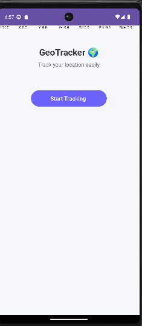

#  SmartLocator - Android Location App

##  Description
SmartLocator est une application mobile Android développée en Java permettant de :
- Obtenir la position GPS de l’utilisateur
- Afficher cette position sur une carte OpenStreetMap
- Visualiser un marqueur indiquant la localisation

L’objectif du projet est de manipuler les services de localisation Android ainsi que l’intégration d’une carte via la bibliothèque OSMDroid.

---

##  Fonctionnalités
- Récupération de la position en temps réel
- Affichage de la carte avec OpenStreetMap
- Ajout d’un marqueur sur la position
- Gestion des permissions (ACCESS_FINE_LOCATION)
-  Navigation entre les activités

---

##  Technologies utilisées
- Java (Android)
- Android Studio
- OSMDroid (OpenStreetMap)
- LocationManager (GPS)

---

##  Structure du projet
- `MainActivity.java` : Gestion du GPS et navigation
- `GoogleMapActivity.java` : Affichage de la carte et du marker
- `activity_main.xml` : Interface principale
- `activity_map.xml` : Interface de la carte

---

##  Exécution du projet

1. Ouvrir le projet avec Android Studio  
2. Connecter un appareil Android ou lancer un émulateur  
3. Exécuter l’application  
4. Autoriser la localisation lorsque demandé  
5. Cliquer sur **Start Tracking ** pour afficher la carte  

---

##  Démonstration

### Fonctionnement de l'application

###  Interface principale

##  Remarques
- Internet requis
- GPS activé
